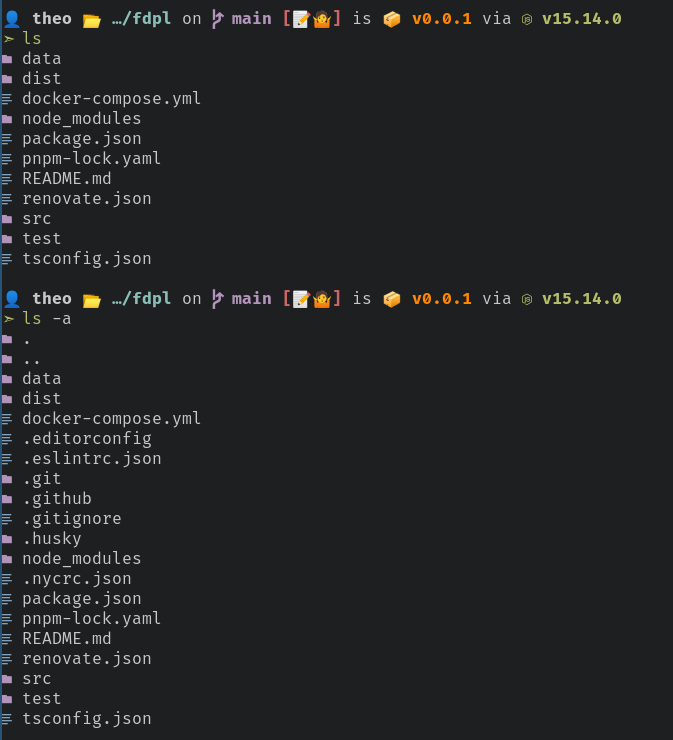

# prett 🚀

A prettifier for sh commands, inspired by [ptSh](https://github.com/jszczerbinsky/ptSh).



## Prequisites

-   A font that is capable of displaying nerd icons.
-   CMake, Make, And Git
-   A shell (eg.zsh, bash)
-   A ansi color-compatible terminal (eg. Alacritty).

## Building

```bash
git clone --recurse-submodules https://github.com/creepinson/prett
cd prett
./compile.sh ~/bin # The path to copy the binary to, defaults to ~/bin
```

## Usage

Run `prett sub-command`.

### Compatible Commands

-   `ls`

## Shell Aliases

You can optionally alias the default commands in your shell to point to the corresponding prett commands.

See [aliases.sh](scripts/aliases.sh).
